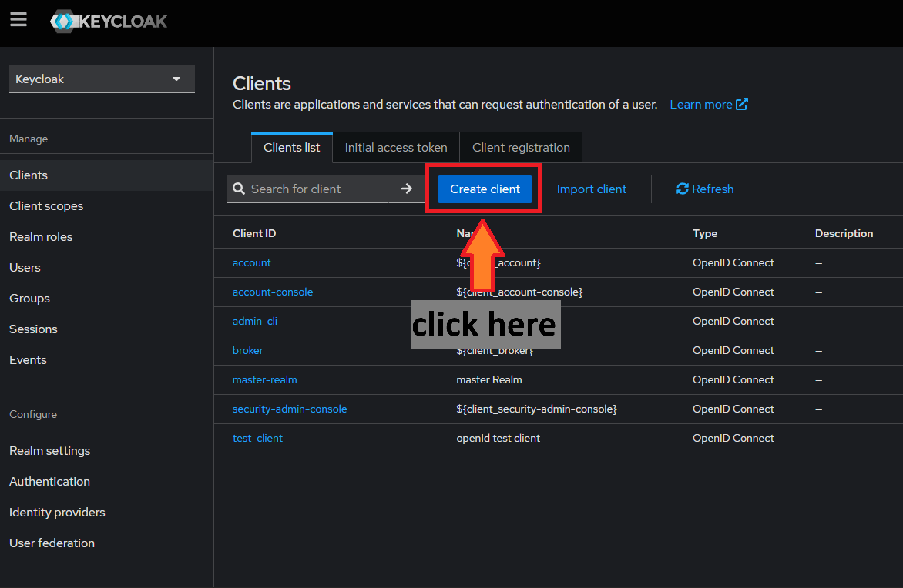

# **此專案內容尚不完善**

# 簡介 

Application Gateway, Base on [Yarp](https://microsoft.github.io/reverse-proxy/).

這個專案的執行需要一次執行三個 C# 專案，調整方式可參考 [官方文件](https://docs.microsoft.com/zh-tw/visualstudio/ide/how-to-set-multiple-startup-projects?view=vs-2022)

Web 專案採用微軟預設範本建立，並調整頁面內容僅留下一個測試用按鈕，因此在執行時還是使用 C# 專案界接 Angular 專案，且使用 Webpack 方式執行

# 架構圖


# 設定說明

> 由於 AppGateway 導流機制會共用同一個 domain，因此建議要掛載在 Gateway 後端的服務中，只要是有需要處理 URL 路徑的部分都應改為相對路徑，避免系統強制轉址到特定頁面時，因為 URL 被覆蓋而無法正確導流的問題。

> 更詳細的 YARP 設定方式可參照 [官方範例](https://github.com/microsoft/reverse-proxy/tree/main/samples)

# authentication / authorization 相關準備

## redis server (for auth)

```bash
docker run -d -p 6379:6379 --name local-redis redis
```

## key clock prepare

### run keycloak

```bash
docker run -d -p 8080:8080 -p 8443:8443 \
    -e KEYCLOAK_ADMIN=user \
    -e KEYCLOAK_ADMIN_PASSWORD=password \
    quay.io/keycloak/keycloak start-dev
```

### import test client

client id testing json : [link](./keycloak/test_client.json)

- open clients page
    
- click import client
    

# 參考資料

* [Building multiple Progressive Web Apps on the same domain](https://web.dev/building-multiple-pwas-on-the-same-domain/)
* [The Token Handler Pattern for Single Page Applications](https://curity.io/resources/learn/the-token-handler-pattern/)
* [Best Practices - OAuth for Single Page Applications](https://curity.io/resources/learn/spa-best-practices/)
* [用 mkcert 產生本機使用的 SSL 憑證](https://w3c.hexschool.com/blog/cd7b449b)
* [stack overflow how-to-implement-windows-authentication-in-a-net-core-api-gateway-using-ocelot](https://stackoverflow.com/questions/70045297/how-to-implement-windows-authentication-in-a-net-core-api-gateway-using-ocelot/70056924)
* [windows ad auth error](https://stackoverflow.com/questions/70045297/how-to-implement-windows-authentication-in-a-net-core-api-gateway-using-ocelot/70056924)
